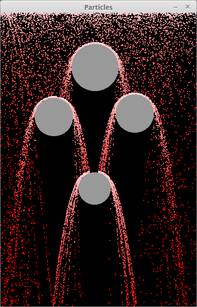
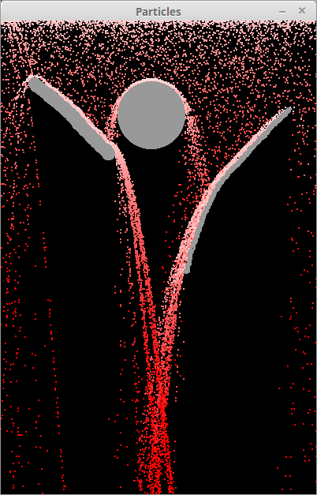
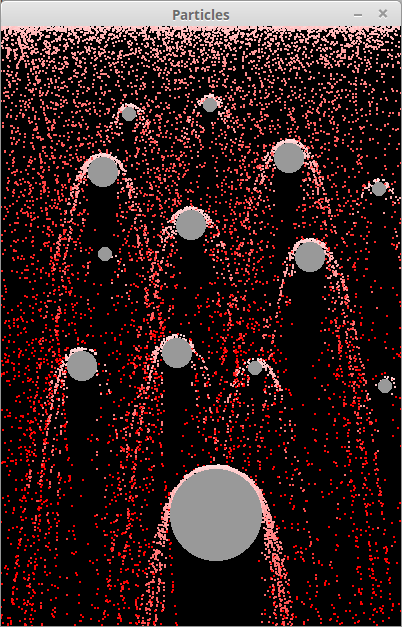

# bouncing-particles
Particle collisions system running on GPU using OpenGL shaders.
Handles 1 million particles at 60 fps on my integrated Intel HD Graphics chip.

# Description
Particle system running on the GPU.
The particles appear on top of the screen and are regenerated when they disappear at tthe bottm. The only force appplied to particles is gravity.
You can draw with left mouse button obstacles on which the particles bounce. R key resets the simulation.

Particles' positions and velocities are stored in textures. Each component is stored in 2 channels of a pixel (making it possible to store 65534 values).

There is an additional buffer containing the obstacles' normals. These normals are used for computing the reflection of particles.

On my integrated Intel chip, I can run a simulation of 1 million particles in 60 fps.

# Screenshots

# Compiling
Developped under Linux using SFML 2.3.2 for OpenGL context creation and shaders management. Requires at least OpenGL 3.0.

A Makefile is placed at the root of the repository, expecting SFML, OpenGL and Glew to be installed on the machine.
